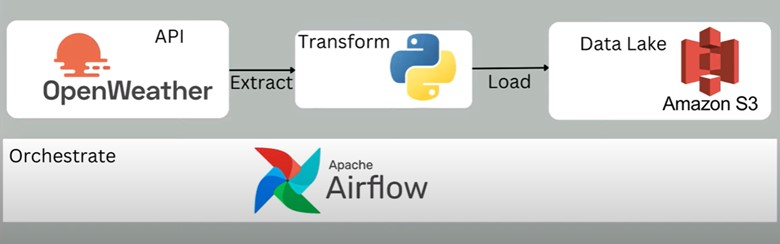

# OpenWeathermap API Airflow ETL AWS Data Engineering Project

## Introduction

In this project, we execute an End-To-End Data Engineering Project on OpenWeathermap API using Airflow.

We are going to use different technologies such as Python, Amazon Web Services (AWS) and Apache Airflow.

## Architecture

## Technologies Used

- Programming Language - Python
- Amazon Web Service (AWS)
1. S3 (Simple Storage Service)
2. EC2
- Apache Airflow

## Dataset Used

We extract data from OpenWeathermap API
https://openweathermap.org/api
